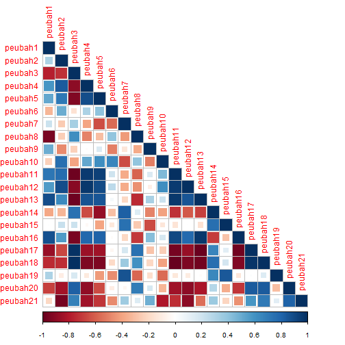
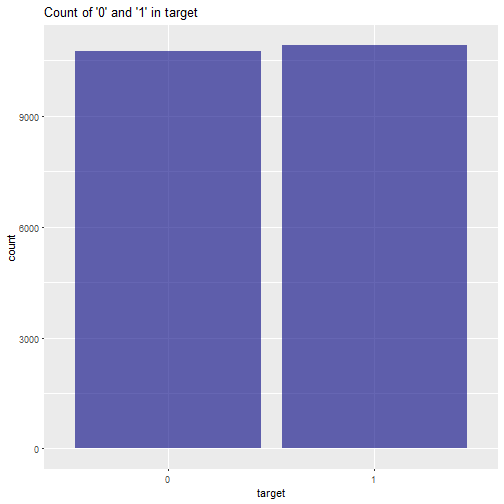

## Executive Summary

In this DIVACTORY 01 Warm Up case study, we are given `Training_Data.csv` and `Test_Data.csv` CSV data files for training and test data correspondingly. 

Objectives for this case study are:

1. Develop an exploratory data analysis based on given training and test datasets
2. Develop a model to minimize negative log-loss function
3. Document the mmodel results in a documentation and slides


---

## Data Processing

Extract the `Training_Data` and `Test_Data` datasets:

```r
Training_Data <- read.csv("Training_Data.csv", header = TRUE, sep = ",")
Test_Data <- read.csv("Test_Data.csv", header = TRUE, sep = ",")
```

---

## Exploratory Data Analysis - Looking at Training Data

```r
str(Training_Data)
```

```
## 'data.frame':	21681 obs. of  22 variables:
##  $ peubah1 : num  0.416 0.393 0.412 0.416 0.431 ...
##  $ peubah2 : num  0.434 0.461 0.464 0.434 0.461 ...
##  $ peubah3 : num  0.48 0.453 0.418 0.483 0.419 ...
##  $ peubah4 : num  0.391 0.405 0.455 0.358 0.45 ...
##  $ peubah5 : num  0.312 0.377 0.415 0.308 0.409 ...
##  $ peubah6 : num  0.35 0.393 0.418 0.342 0.45 ...
##  $ peubah7 : num  0.48 0.407 0.336 0.501 0.371 ...
##  $ peubah8 : num  0.367 0.409 0.397 0.376 0.372 ...
##  $ peubah9 : num  0.297 0.256 0.359 0.271 0.324 ...
##  $ peubah10: num  0.408 0.491 0.497 0.422 0.458 ...
##  $ peubah11: num  0.328 0.368 0.404 0.319 0.404 ...
##  $ peubah12: num  0.377 0.429 0.452 0.367 0.438 ...
##  $ peubah13: num  0.346 0.358 0.396 0.339 0.404 ...
##  $ peubah14: num  0.519 0.479 0.413 0.538 0.423 ...
##  $ peubah15: num  0.462 0.447 0.368 0.476 0.394 ...
##  $ peubah16: num  0.352 0.335 0.389 0.342 0.388 ...
##  $ peubah17: num  0.455 0.446 0.415 0.458 0.408 ...
##  $ peubah18: num  0.481 0.452 0.413 0.491 0.412 ...
##  $ peubah19: num  0.442 0.422 0.359 0.455 0.391 ...
##  $ peubah20: num  0.382 0.376 0.373 0.392 0.367 ...
##  $ peubah21: num  0.361 0.305 0.299 0.37 0.322 ...
##  $ target  : int  1 0 0 1 1 1 0 1 1 0 ...
```

---

## Exploratory Data Analysis - Testing Data, Output as Factor


```r
str(Test_Data)
Training_Data$target <- as.factor(Training_Data$target)
```

---

## Exploratory Data Analysis - Range of Values in Input Variables


```r
summary(Training_Data)
```

```
##     peubah1          peubah2          peubah3           peubah4      
##  Min.   :0.0000   Min.   :0.0265   Min.   :0.08678   Min.   :0.0000  
##  1st Qu.:0.3758   1st Qu.:0.3918   1st Qu.:0.43228   1st Qu.:0.3426  
##  Median :0.4052   Median :0.4346   Median :0.46691   Median :0.3827  
##  Mean   :0.4041   Mean   :0.4285   Mean   :0.46388   Mean   :0.3785  
##  3rd Qu.:0.4363   3rd Qu.:0.4720   3rd Qu.:0.49945   3rd Qu.:0.4191  
##  Max.   :0.6808   Max.   :0.6661   Max.   :0.68957   Max.   :0.6288  
##     peubah5           peubah6           peubah7           peubah8       
##  Min.   :0.01573   Min.   :0.06821   Min.   :0.04294   Min.   :0.06272  
##  1st Qu.:0.31949   1st Qu.:0.36199   1st Qu.:0.39151   1st Qu.:0.36220  
##  Median :0.35690   Median :0.40701   Median :0.43157   Median :0.39411  
##  Mean   :0.35554   Mean   :0.40325   Mean   :0.42613   Mean   :0.39331  
##  3rd Qu.:0.39357   3rd Qu.:0.44870   3rd Qu.:0.46296   3rd Qu.:0.42481  
##  Max.   :0.59906   Max.   :0.69315   Max.   :0.66133   Max.   :0.69315  
##     peubah9            peubah10         peubah11       
##  Min.   :0.005346   Min.   :0.0000   Min.   :0.001948  
##  1st Qu.:0.242413   1st Qu.:0.4130   1st Qu.:0.308727  
##  Median :0.283388   Median :0.4519   Median :0.347334  
##  Mean   :0.288719   Mean   :0.4461   Mean   :0.345317  
##  3rd Qu.:0.330045   3rd Qu.:0.4859   3rd Qu.:0.384664  
##  Max.   :0.679363   Max.   :0.6655   Max.   :0.630127  
##     peubah12            peubah13           peubah14         peubah15     
##  Min.   :0.0007097   Min.   :0.007948   Min.   :0.1275   Min.   :0.0646  
##  1st Qu.:0.3475252   1st Qu.:0.321467   1st Qu.:0.4516   1st Qu.:0.3957  
##  Median :0.3905207   Median :0.354438   Median :0.4861   Median :0.4352  
##  Mean   :0.3862154   Mean   :0.353111   Mean   :0.4830   Mean   :0.4297  
##  3rd Qu.:0.4291426   3rd Qu.:0.387220   3rd Qu.:0.5171   3rd Qu.:0.4688  
##  Max.   :0.6603450   Max.   :0.651168   Max.   :0.6929   Max.   :0.6636  
##     peubah16          peubah17          peubah18         peubah19       
##  Min.   :0.01702   Min.   :0.06889   Min.   :0.1159   Min.   :0.001149  
##  1st Qu.:0.30723   1st Qu.:0.42082   1st Qu.:0.4327   1st Qu.:0.387125  
##  Median :0.34110   Median :0.45101   Median :0.4671   Median :0.425967  
##  Mean   :0.34021   Mean   :0.44853   Mean   :0.4646   Mean   :0.420817  
##  3rd Qu.:0.37417   3rd Qu.:0.47993   3rd Qu.:0.4996   3rd Qu.:0.456107  
##  Max.   :0.62958   Max.   :0.69082   Max.   :0.6912   Max.   :0.659270  
##     peubah20          peubah21       target   
##  Min.   :0.06297   Min.   :0.03861   0:10756  
##  1st Qu.:0.36750   1st Qu.:0.31216   1:10925  
##  Median :0.39835   Median :0.35353            
##  Mean   :0.39924   Mean   :0.35739            
##  3rd Qu.:0.43211   3rd Qu.:0.40094            
##  Max.   :0.65263   Max.   :0.69315
```

---

## Exploratory Data Analysis - Scatterplot between Variables


---

## Exploratory Data Analysis - Cross Correlations



---

## Exploratory Data Analysis - Input Variables

```
## Error: nrow * ncol >= n is not TRUE
```


---

## Exploratory Data Analysis - # of 0 and 1 Outputs


---

## Overview of Negative Log-Loss Function
Logarithmic Loss, or simply Log Loss, is a classification loss function often used as an evaluation metric for classifiers
$$logloss = - \frac{1}{N} \sum_{i=1}^{N} \sum_{j=1}^M y_{i,j} \log (p_{i,j})$$

If there are only two classes then the expression above simplifies to
$$logloss = - \frac{1}{N} \sum_{i=1}^{N} [y_i \log p_i + (1-y_i) \log (1 - p_i)]$$

---

## Model 1 - Logistic Regression


```r
library(caret)
library(MLmetrics)
library(stats)
glm.model <- train(target ~ ., data = Training_Data, method = "glm", family = "binomial")
(glm.ll_train <- LogLoss(y_true = as.numeric(Training_Data$target)-1, 
                               y_pred = glm.model$finalModel$fitted.values))
```

```
## [1] 0.6912029
```

```r
glm.pred_train <- predict(glm.model$finalModel, Training_Data, type = "response")
glm.pred_train <- ifelse(glm.pred_train > 0.5, 1, 0)
(MissClassifError <- mean(glm.pred_train != Training_Data$target))
```

```
## [1] 0.4742862
```

---

## Model 2 - Logistic Regression with PCA


```r
glm2.model <- train(target ~ ., data = Training_Data, method = "glm",
                    family = "binomial", preProcess = "pca")
(glm2.ll_train <- LogLoss(y_true = as.numeric(Training_Data$target)-1,
                         y_pred = glm2.model$finalModel$fitted.values))
```

```
## [1] 0.692582
```

```r
glm2.pred_train <- predict(glm2.model, Training_Data, type = "prob")[,2]
glm2.pred_train <- ifelse(glm2.pred_train > 0.5, 1, 0)
(MissClassifError <- mean(glm2.pred_train != Training_Data$target))
```

```
## [1] 0.4862783
```

---

## Model 3 - LDA


```r
lda.model <- train(target ~ ., data = Training_Data, method = "lda")
lda.pred_train <- predict(lda.model, Training_Data, type = "prob")[,2]
(lda.ll_train <- LogLoss(y_true = as.numeric(Training_Data$target)-1,
                        y_pred = lda.pred_train))
```

```
## [1] 0.6912032
```

```r
lda.pred_train <- ifelse(lda.pred_train > 0.5, 1, 0)
(MissClassifError <- mean(lda.pred_train != Training_Data$target))
```

```
## [1] 0.474194
```

---

## Analysis and Conclusion

1. Input variables in `Training_Data` are almost i.i.d

2. Probability of output `1` is about 0.5, hence probability of output `0` is also about 0.5

3. Negative log-loss function given this `Training_Data` set for different models are almost similar, at about 0.69. We can approximate this value by taking $p_i$ = 0.5 and $y_i$ = 1 to our binary log-loss function
